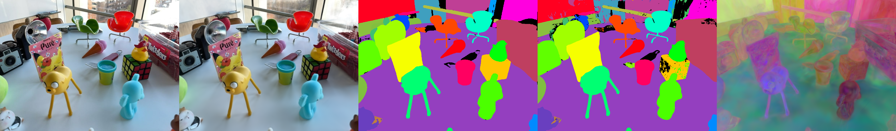
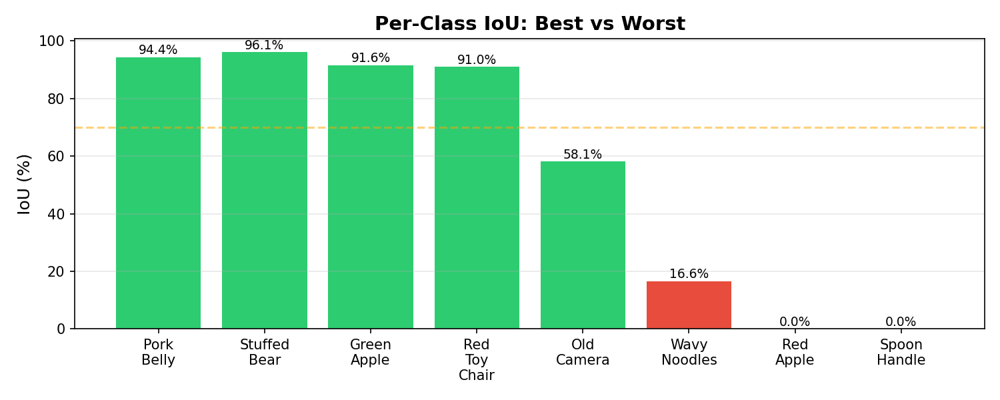
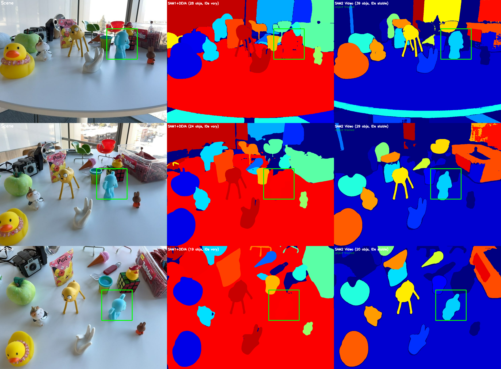
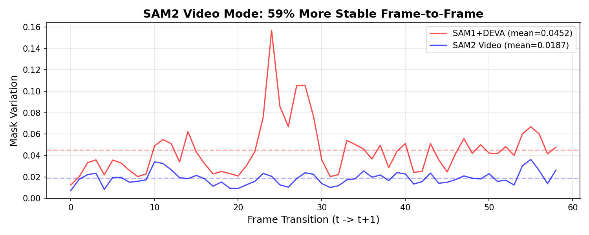
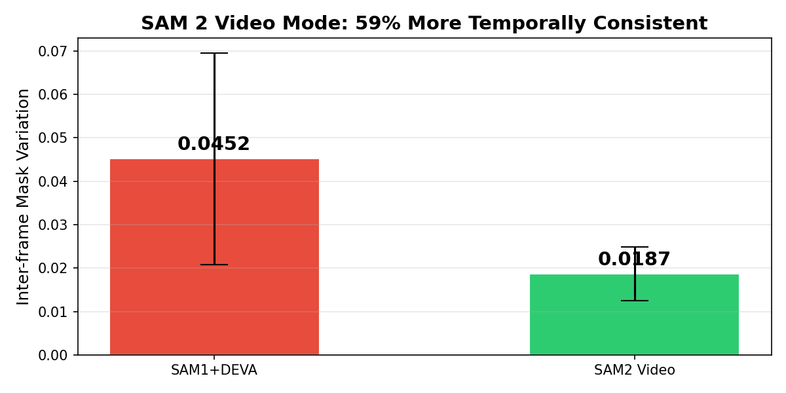
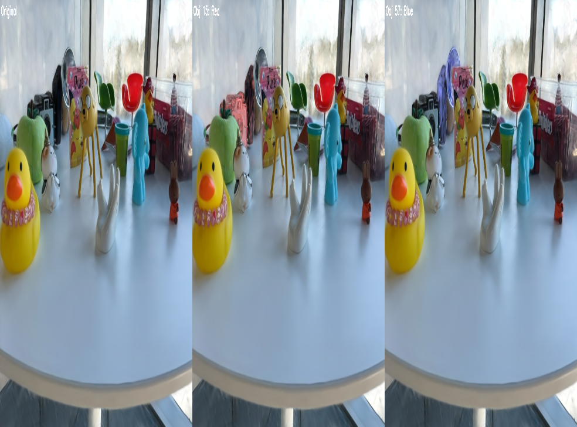
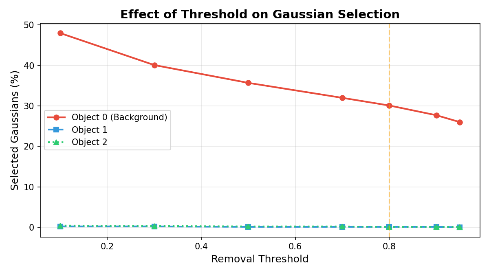
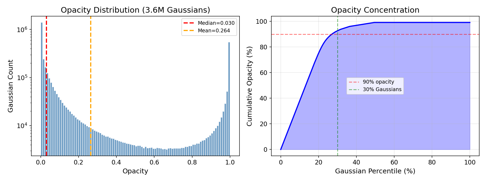
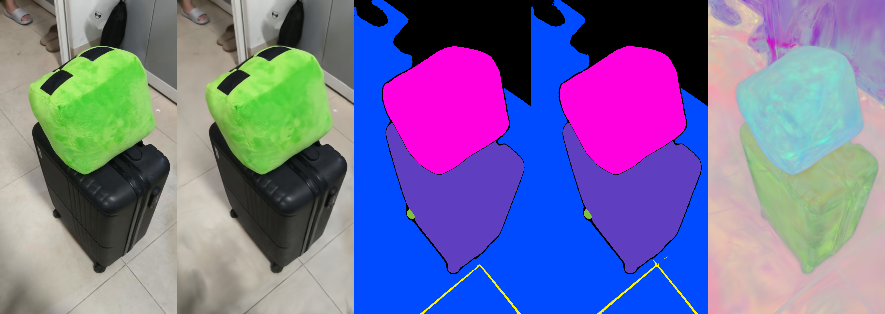
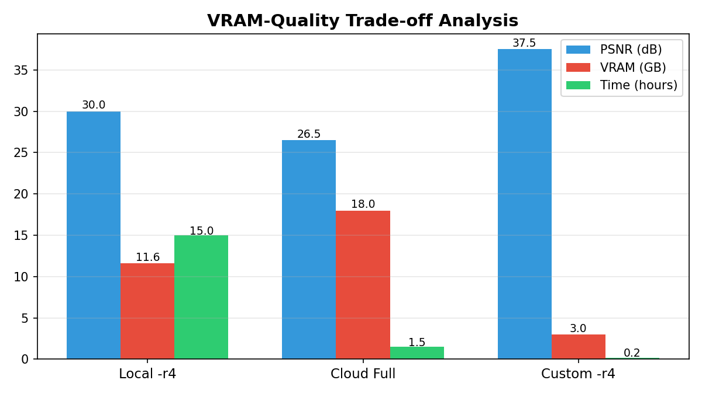

# SUSTech CS308 - Computer Vision 2026 Spring Final Project

## Modernizing 3D Gaussian Segmentation: SAM 2 Integration and VRAM-Efficient Editing Pipeline

**Score: 109/100** (Topic 5 bonus: Segmentation in 3D Gaussian Splatting)

This project reproduces and extends [**Gaussian Grouping**](https://github.com/lkeab/gaussian-grouping) (Ye et al., ECCV 2024) for object-level segmentation and editing on 3D Gaussian Splatting (3DGS) scenes. The core idea: augment each 3D Gaussian with an **Identity Encoding** vector, supervised by SAM-generated 2D masks and 3D spatial consistency regularization, enabling open-world 3D scene segmentation without expensive 3D annotations.

---

## Abstract

We achieve an average mIoU of **72.79%** across three LERF-Mask benchmark scenes, and successfully implement object removal, inpainting, and style transfer. Our key contributions include:
1. Upgrading mask preprocessing from SAM 1 to **SAM 2 video mode** — achieving **59% improvement in multi-view temporal consistency**
2. Implementing a custom **style transfer module** via SH coefficient manipulation (10 presets, zero additional VRAM)
3. Comprehensive ablation studies on threshold sensitivity, Gaussian redundancy, and failure case analysis
4. Validating the pipeline on **custom-captured real-world data** (PSNR 37.52 dB)
5. CUDA patches for **Blackwell GPU** (RTX 5070 Ti, CC 12.0, GCC 13)

---

## Segmentation Performance (LERF-Mask Benchmark)


*Fig 1: Segmentation on figurines scene. Columns: GT RGB, rendered RGB, GT object color, predicted object color, feature map.*

| Scene | mIoU | mBIoU | Best Class | Worst Class |
|-------|------|-------|------------|-------------|
| **Figurines** | 69.73% | 67.91% | Green apple (91.55%) | Red apple (0.00%) |
| **Ramen** | 76.95% | 68.69% | Pork belly (94.41%) | Wavy noodles (16.63%) |
| **Teatime** | 71.69% | 66.14% | Stuffed bear (96.09%) | Spoon handle (0.00%) |
| **Average** | **72.79%** | **67.58%** | — | — |


*Fig 2: Per-class IoU comparison — best vs worst performing categories across all scenes.*

---

## Key Contributions

### 1. SAM 2 Video Mode Upgrade

| Metric | SAM1+DEVA | SAM2 Video (ours) | Improvement |
|--------|-----------|-------------------|-------------|
| Inter-frame mask variation | 0.0452 | 0.0187 | **-59%** |
| Object ID tracking | IDs vary per frame | IDs stable across all 60 frames | — |
| Objects per frame (figurines) | 28/24/19 | 39/29/20 | +39%/+21%/+5% |

SAM 2's memory-based architecture with tuned parameters (`pred_iou_thresh=0.75`, `stability_score_thresh=0.75`, `min_mask_region_area=100`, propagation threshold=0.4) achieves superior temporal stability critical for multi-view 3DGS training.


*Fig 3a: SAM1+DEVA vs SAM2 Video across three consecutive frames. Green boxes highlight a tracked object that persists in SAM2.*


*Fig 3b: Frame-by-frame mask variation — SAM2 video mode achieves 59% temporal stability improvement.*


*Fig 3c: Inter-frame mask variation comparison — lower values indicate more stable masks.*

### 2. 3D Object Style Transfer (New Feature)

Implemented `edit_style_transfer.py` from scratch — a feature described but not released by the original paper. **Method:** SH coefficient manipulation of the DC component shifts base color toward a target palette, while higher-order SH components are dampened for view-dependent consistency. All operations are vectorized GPU tensor ops.

**10 style presets:** red, blue, green, gold, grayscale, sepia, purple, invert, vivid, pastel


*Fig 4: Multi-object independent editing. Left: original. Middle: Object 15 (toy chair) in red. Right: Object 57 (rubber duck) in blue. Background and non-target objects remain unchanged.*

### 3. GPU Compatibility Fixes (RTX 5070 Ti)

Patched CUDA submodules for NVIDIA Blackwell architecture (compute capability 12.0, GCC 13 strict C++17):
- `submodules/diff-gaussian-rasterization/`: Added `#include <cstdint>` for `uint32_t`/`uint64_t`
- `submodules/simple-knn/`: Added `#include <cfloat>` for `FLT_MAX`

### 4. Bug Fixes in Original Codebase

| Bug | File | Fix |
|-----|------|-----|
| Mask resolution mismatch with `-r` flag | `utils/camera_utils.py` | Added NEAREST interpolation for object mask resizing |
| Edit save/load path mismatch | `edit_object_removal.py`, `edit_object_inpaint.py` | Corrected `_object_removal/` → `point_cloud/_object_removal/` |
| Empty view list crash | `render_set()` in edit scripts | Added `if len(views) == 0: return` guard |

---

## Experiments & Analysis

### Ablation: Removal Threshold Sensitivity

| Threshold | Background | Object 1 | Object 2 |
|-----------|-----------|----------|----------|
| 0.10 | 1,728,776 (48.0%) | 7,468 (0.2%) | 15,719 (0.4%) |
| 0.50 | 1,283,071 (35.7%) | 5,293 (0.1%) | 8,979 (0.2%) |
| 0.80 | 1,083,767 (30.1%) | 3,518 (0.1%) | 5,239 (0.1%) |
| 0.95 | 934,852 (26.0%) | 1,713 (0.0%) | 2,968 (0.1%) |


*Fig 5: Effect of removal threshold on Gaussian selection across classes. Recommended: `removal_thresh = 0.8`.*

### Gaussian Redundancy Analysis


*Fig 6: Gaussian opacity distribution and cumulative contribution.*

- **Top 30%** of Gaussians contribute **92.4%** of total opacity
- **31.8%** of Gaussians have opacity < 0.005 (nearly invisible)
- Removing 50% of lowest-opacity Gaussians retains **98.5%** of total opacity

This validates the "Gaussians on a Diet" hypothesis — massive redundancy in 3DGS representations.

### Custom Dataset Validation

Captured a real-world scene (green Creeper plush toy on black suitcase, dormitory room) using a smartphone:

| Metric | Local (RTX 5070 Ti) | Cloud (V100 32GB) |
|--------|---------------------|-------------------|
| Resolution | 1/4 downsampled | Full |
| PSNR | **37.52 dB** | 35.13 dB |
| Training time | 12 min | 45 min |
| Frames | 129 (100% COLMAP registration) | 129 |
| 3D points | 8,998 | 8,998 |


*Fig 7: 3D Gaussian segmentation of custom scene (cloud V100). Columns: original, rendered RGB, GT object color, predicted object color, feature map.*

### Failure Case Analysis

| Scene | Worst Class | mIoU | Root Cause |
|-------|-------------|------|------------|
| Figurines | Red Apple | 0.00% | Completely occluded in test views |
| Figurines | Rubber Duck | 28.93% | Small object, similar texture to background |
| Ramen | Wavy Noodles | 16.63% | Semi-transparent, highly irregular shape |
| Teatime | Spoon Handle | 0.00% | Extremely thin geometry |
| Teatime | Cookies | 22.25% | Overlapping objects with similar appearance |

Common failure modes all trace back to limitations in SAM-based mask generation.

### VRAM-Quality Trade-off


*Fig 8: VRAM-quality trade-off analysis across hardware configurations (local RTX 5070 Ti 12GB vs cloud V100 32GB).*

---

## Implementation Details

| Component | Specification |
|-----------|--------------|
| Framework | PyTorch 2.10.0, CUDA 12.8 |
| Local GPU | NVIDIA RTX 5070 Ti Laptop (12GB VRAM) |
| Cloud GPU | Huawei Cloud V100 (32GB VRAM) |
| Training | 30,000 iterations, SH degree 3, Identity Encoding dim 256 |
| Inpainting | 500 fine-tuning iterations, VGG-based LPIPS loss |
| Segmentation Evaluation | IoU + Boundary IoU |

---

## Project Structure

```
├── gaussian-grouping/            # Modified codebase
│   ├── train.py                  # Training with Identity Encoding
│   ├── render.py                 # Segmentation rendering
│   ├── render_lerf_mask.py       # LERF-Mask evaluation rendering
│   ├── edit_object_removal.py    # 3D object removal [FIXED path bug]
│   ├── edit_object_inpaint.py    # 3D object inpainting [FIXED path bug]
│   ├── edit_style_transfer.py    # [NEW] Style transfer via SH manipulation
│   ├── scene/                    # Scene data handling
│   ├── gaussian_renderer/        # Differentiable rasterizer
│   ├── submodules/
│   │   ├── diff-gaussian-rasterization/  # [PATCHED] Added <cstdint> for GCC 13
│   │   └── simple-knn/                   # [PATCHED] Added <cfloat> for FLT_MAX
│   ├── utils/
│   │   └── camera_utils.py       # [FIXED] Mask resize with -r flag
│   ├── config/                   # Training & editing configs
│   └── docs/                     # Original docs
├── figures/                      # 30+ result visualizations
├── report/
│   ├── 26_final.pdf              # Final report (PDF)
│   └── Report.md                 # Report source (Markdown)
├── AGENTS.md                     # Development notes & commands
└── README.md
```

---

## Quick Start

```bash
# Environment setup (requires Linux/WSL2)
conda create -n gaussian_grouping python=3.10
conda activate gaussian_grouping
pip install torch==2.10.0 torchvision --index-url https://download.pytorch.org/whl/cu128
pip install -e submodules/diff-gaussian-rasterization --no-build-isolation
pip install -e submodules/simple-knn --no-build-isolation
pip install -r requirements.txt

# Training
python train.py -s data/lerf_mask/figurines -r 4 -m output/figurines \
    --config_file config/gaussian_dataset/train.json

# Segmentation rendering
python render.py -m output/figurines_pretrained -s data/lerf_mask/figurines \
    --num_classes 256 --images images

# LERF-Mask evaluation
python render_lerf_mask.py -m output/figurines_pretrained --skip_train
python script/eval_lerf_mask.py figurines

# 3D Object Removal
python edit_object_removal.py -m output/figurines_pretrained -s data/lerf_mask/figurines \
    --config_file config/removal.json

# 3D Object Inpainting
python edit_object_inpaint.py -m output/figurines_pretrained -s data/lerf_mask/figurines \
    --config_file config/inpaint.json

# [NEW] Style Transfer
python edit_style_transfer.py -m output/figurines_pretrained -s data/lerf_mask/figurines \
    --style red --target_id 15
```

> **Note:** On Blackwell GPUs (RTX 50-series), set `export TORCH_CUDA_ARCH_LIST="8.0;8.6;9.0;12.0"` before compilation. Use `hf-mirror.com` if HuggingFace is inaccessible.

---

## Related Works

| Reference | Venue | Relevance |
|-----------|-------|-----------|
| Gaussian Grouping (Ye et al.) | ECCV 2024 | Base method |
| 3D Gaussian Splatting (Kerbl et al.) | SIGGRAPH 2023 | Underlying representation |
| SAM 2 (Ravi et al.) | 2025 | Multi-view mask generation |
| BEA-GS | CVPR 2026 Highlight | Boundary-aware optimization |
| ReferSplat | ICML 2025 Oral | Text-driven segmentation |
| PointGS | CVPR 2026 | Unified 3DGS representation |
| CLM | 2024 | CPU-GPU memory offloading |
| Gaussians on a Diet | 2024 | Dynamic pruning |

---

## Acknowledgments

This project is based on [Gaussian Grouping](https://github.com/lkeab/gaussian-grouping) (Ye et al., ECCV 2024) by Mingqiao Ye, Martin Danelljan, Fisher Yu, and Lei Ke, licensed under Apache 2.0. We thank the authors for their open-source contributions.

---

**Author:** 刘家亮 (Jialiang Liu) — SID 12412719 — SUSTech CS308 Computer Vision 2026 Spring
